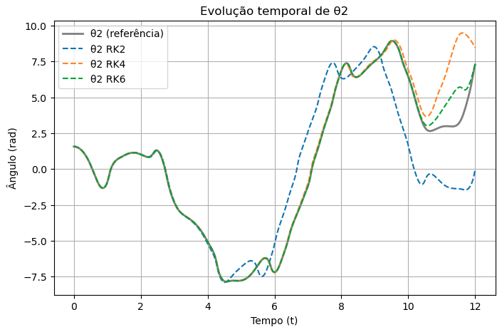
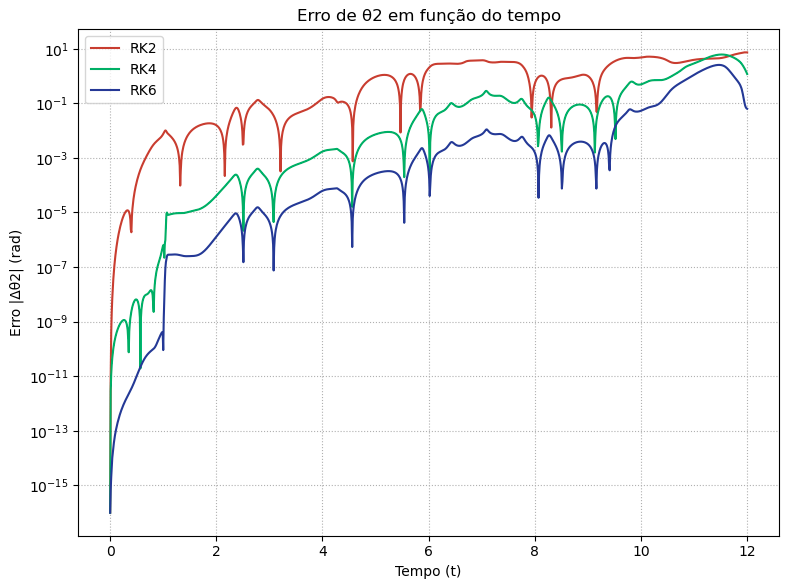
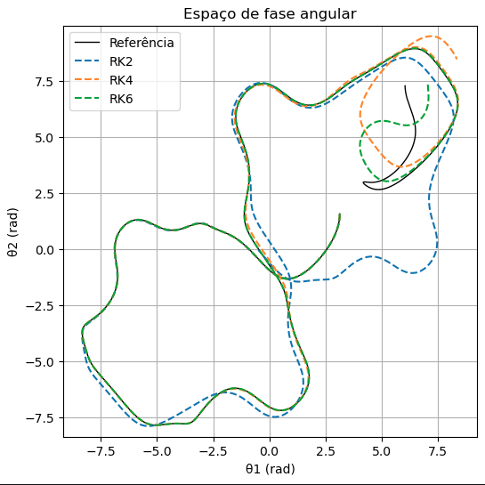
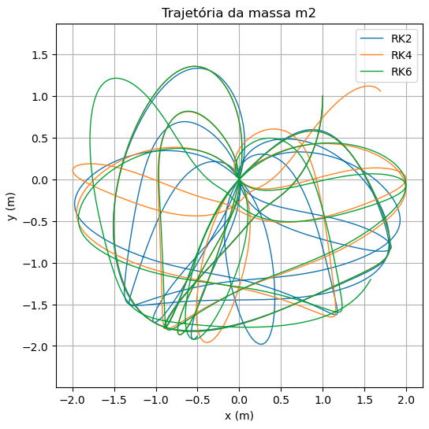
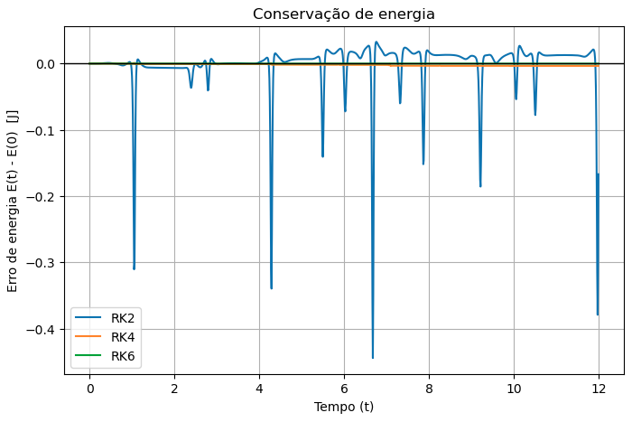
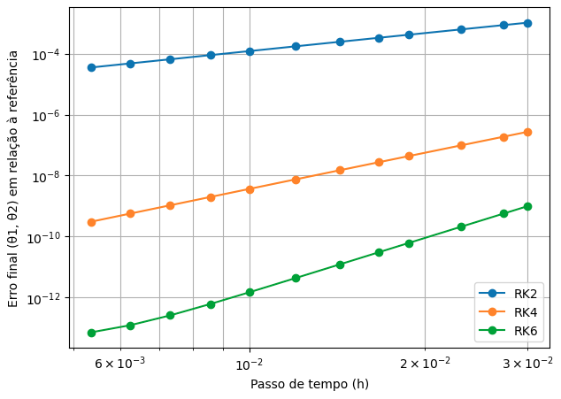

# Pêndulo Duplo: Integração Numérica com RK2, RK4 e RK6

Estudo comparativo de três métodos de Runge-Kutta explícitos, ordens 2, 4 e 6 (fórmula de Luther), aplicados à integração do pêndulo duplo, um sistema dinâmico conservativo não linear com dinâmica caótica. O projeto verifica empiricamente a ordem de convergência de cada método e quantifica o erro de conservação de energia como diagnóstico da qualidade da integração.

## 1. Formulação do problema

### 1.1 Modelo físico

Duas massas puntiformes $m_1$, $m_2$ conectadas por hastes rígidas e sem massa de comprimentos $l_1$, $l_2$, sob gravidade $g$, com ângulos $\theta_1$, $\theta_2$ medidos a partir da vertical. A Lagrangiana do sistema é

$$
\mathcal{L} = T - V
$$

$$
T = \frac{1}{2}(m_1+m_2) l_1^2 \dot\theta_1^2 + \frac{1}{2} m_2 l_2^2 \dot\theta_2^2 + m_2 l_1 l_2 \dot\theta_1 \dot\theta_2 \cos(\theta_1-\theta_2)
$$

$$
V = -(m_1+m_2) g l_1 \cos\theta_1 - m_2 g l_2 \cos\theta_2
$$

Aplicando as equações de Euler–Lagrange,

$$
\frac{d}{dt}\left(\frac{\partial \mathcal{L}}{\partial \dot\theta_i}\right) - \frac{\partial \mathcal{L}}{\partial \theta_i} = 0, \qquad i = 1,2,
$$

obtém-se o sistema de EDOs de segunda ordem acoplado e não linear que, escrito na forma vetorial de primeira ordem $y = (\theta_1, \omega_1, \theta_2, \omega_2)$, $\dot y = f(t,y)$, está implementado em `deriv(t, y)`. Com $\Delta = \theta_1 - \theta_2$:

$$
\dot\omega_1 = \frac{-g(2m_1+m_2)\sin\theta_1 - m_2 g \sin(\theta_1-2\theta_2) - 2\sin\Delta   m_2\left(\omega_2^2 l_2 + \omega_1^2 l_1 \cos\Delta\right)}{l_1\left(2m_1 + m_2 - m_2\cos 2\Delta\right)}
$$

$$
\dot\omega_2 = \frac{2\sin\Delta \left(\omega_1^2 l_1 (m_1+m_2) + g(m_1+m_2)\cos\theta_1 + \omega_2^2 l_2 m_2 \cos\Delta\right)}{l_2\left(2m_1 + m_2 - m_2\cos 2\Delta\right)}
$$

(forma equivalente à de Weisstein, *Double Pendulum*). O sistema não admite solução analítica fechada e exibe sensibilidade exponencial a condições iniciais para energias suficientemente altas, o que o torna um problema-teste adequado para comparar integradores: qualquer diferença de precisão entre métodos é amplificada pela dinâmica.

Duas quantidades derivadas do estado são calculadas para diagnóstico:

- `posicoes(y)`: mapeia $(\theta_1,\theta_2) \to (x_1,y_1), (x_2,y_2)$ no plano cartesiano, com $x_1 = l_1 \sin\theta_1$, $y_1 = -l_1\cos\theta_1$, $x_2 = x_1 + l_2\sin\theta_2$, $y_2 = y_1 - l_2\cos\theta_2$.
- `energia(y)`: energia mecânica total

$$
E = \underbrace{\frac{1}{2}m_1 l_1^2 \omega_1^2 + \frac{1}{2}m_2\left(l_1^2\omega_1^2 + l_2^2\omega_2^2 + 2 l_1 l_2 \omega_1\omega_2\cos\Delta\right)}_{T}  \underbrace{- (m_1+m_2)g l_1\cos\theta_1 - m_2 g l_2\cos\theta_2}_{V}
$$

Como o sistema é conservativo (sem dissipação nem forçamento), $E(t)$ deve ser constante na solução exata — o desvio $E(t) - E(0)$ é usado como estimador de erro independente da trajetória, sem precisar de uma solução de referência.

### 1.2 Não linearidade e sensibilidade

O denominador comum $l\left(2m_1 + m_2 - m_2\cos 2\Delta\right)$ e o acoplamento trigonométrico entre $\theta_1$ e $\theta_2$ tornam o sistema não integrável analiticamente, ao contrário do pêndulo simples. Isso é proposital: qualquer erro de truncamento cometido pelo integrador se propaga de forma não linear e, para condições iniciais de alta energia (como $\theta_1(0)=\pi/2$, $\theta_2(0)=\pi$ usadas aqui), o sistema opera em regime caótico.

## 2. Métodos numéricos

Todos os métodos são Runge–Kutta explícitos, de passo fixo $h$, com assinatura comum $y_{n+1} = \Phi(t_n, y_n, h)$, o que permite reusar `integrar(metodo, y0, T, h)` para qualquer um deles. Para um método de $s$ estágios, define-se

$$
k_i = f\left(t_n + c_i h,  y_n + h\sum_{j \lt i} a_{ij} k_j\right), \qquad y_{n+1} = y_n + h\sum_{i=1}^{s} b_i k_i,
$$

com o tableau de Butcher $(c_i,  a_{ij},  b_i)$ determinando o método.

### 2.1 RK2 (Heun / trapézio explícito) — ordem 2, 2 estágios

| $c$ | $k_1$ | $k_2$ |
|---|---|---|
| 0 | | |
| 1 | 1 | |
| **$b$** | **1/2** | **1/2** |

Erro local de truncamento $\mathcal{O}(h^3)$, erro global $\mathcal{O}(h^2)$.

### 2.2 RK4 (clássico) — ordem 4, 4 estágios

| $c$ | $k_1$ | $k_2$ | $k_3$ | $k_4$ |
|---|---|---|---|---|
| 0 | | | | |
| 1/2 | 1/2 | | | |
| 1/2 | 0 | 1/2 | | |
| 1 | 0 | 0 | 1 | |
| **$b$** | **1/6** | **1/3** | **1/3** | **1/6** |

Erro local $\mathcal{O}(h^5)$, erro global $\mathcal{O}(h^4)$.

### 2.3 RK6 (Luther, 1968) — ordem 6, 7 estágios

Fórmula explícita de Luther (1968), único par conhecido de coeficientes que satisfaz as 37 condições de ordem para um método explícito de ordem 6 com 7 estágios, com $q = \sqrt{21}$ nos coeficientes $a_{ij}$ e $c_i$:

$$
c = \left(0,  1,  \tfrac12,  \tfrac23,  \tfrac{7-q}{14},  \tfrac{7+q}{14},  1\right), \qquad
b = \left(\tfrac{1}{20},  0,  \tfrac{16}{45},  0,  \tfrac{49}{180},  \tfrac{49}{180},  \tfrac{1}{20}\right)
$$

(tableau completo dos $a_{ij}$ em `rk6_step`). Erro local $\mathcal{O}(h^7)$, erro global $\mathcal{O}(h^6)$.

O RK6 cumpre dois papéis no projeto:

1. Um dos três métodos comparados nas simulações de $T = 12 \mathrm{s}$.
2. **Solução de referência** de alta precisão ($h = 10^{-4}$ ou $10^{-6}$, conforme o experimento), usada para estimar o erro dos demais métodos na ausência de solução analítica, procedimento padrão quando não há forma fechada disponível.

## 3. Metodologia dos experimentos

Todos os experimentos comparam RK2, RK4 e RK6 sob as mesmas condições iniciais $y_0 = (\pi/2,  0,  \pi,  0)$, $m_1=m_2=l_1=l_2=1$, $g=9.8\ \mathrm{m/s^2}$.

**(a) Evolução temporal e espaço de fase.** $\theta_1(t)$ e o retrato $(\theta_1,\theta_2)$ são integrados com $h=0.01$ fixo e sobrepostos à referência RK6 de alta precisão. A divergência progressiva de trajetória entre métodos de ordem baixa e a referência, após poucos períodos, é o efeito esperado em sistema caótico e evidencia visualmente a diferença de acúmulo de erro entre ordens.

RK2 e RK4 descolam visivelmente da referência (preto) a partir de $t \approx 6\text{–}7\ \mathrm{s}$; RK6 (verde tracejado) permanece sobreposto à referência por toda a janela, consistente com seu erro global de ordem $\mathcal{O}(h^6)$.

Para quantificar essa divergência, calcula-se o erro absoluto instantâneo de $\theta_2$ em relação à referência,

$$
\varepsilon_2(t) = \left|\theta_2^{\text{método}}(t) - \theta_2^{\text{ref}}(t)\right|,
$$

com $\theta_2^{\text{ref}}(t)$ obtido por interpolação spline cúbica da referência RK6 ($h=10^{-4}$) nos instantes de tempo da solução numérica de cada método.

Em escala log (eixo y), o erro cresce de forma aproximadamente exponencial com $t$, assinatura típica de sensibilidade a condições iniciais em sistemas caóticos, partindo do nível de arredondamento de máquina ($\sim 10^{-16}$) em $t=0$. RK2 (vermelho) atinge erro de ordem $\mathcal{O}(1)$ já por volta de $t\approx 1\text{–}2\,\mathrm{s}$, RK4 (verde) segue a referência por mais tempo antes de descolar, e RK6 (azul) mantém o menor erro ao longo de quase toda a janela, embora todos os três acabem divergindo de forma equivalente após tempo suficiente, limite fundamental imposto pelo caos, não pela ordem do integrador.

No espaço $(\theta_1,\theta_2)$ o mesmo efeito aparece como divergência de laços: RK2 (azul) e RK4 (laranja) se afastam da referência após poucas voltas, enquanto RK6 (verde) acompanha a curva preta de referência quase exatamente.

**(b) Trajetória cartesiana de $m_2$.** Mesma comparação em $(x_2,y_2)$, ilustrando o efeito acumulado do erro de fase na trajetória física.

As três trajetórias partem do mesmo ponto e permanecem próximas nos primeiros instantes, mas divergem por completo ao longo dos 12 s simulados, assinatura visual da sensibilidade a condições iniciais/erro numérico típica de sistemas caóticos, e não indício de erro de implementação.

**(c) Conservação de energia.** Calcula-se $E(t) - E(0)$ para cada método ao longo de $T=12 \mathrm{s}$. Por não haver dissipação no modelo, qualquer crescimento de $|E(t)-E(0)|$ é puramente erro numérico, permitindo comparar diretamente a qualidade dos três integradores sem depender de uma solução de referência.

RK2 (azul) apresenta picos de erro de energia de até $\sim 0.2\ \mathrm{J}$, coincidindo com as regiões de maior divergência de trajetória em (a)-(b). RK4 e RK6 mantêm $|E(t)-E(0)|$ próximo de zero durante toda a simulação, na escala do gráfico, a diferença entre eles só fica visível na análise de convergência a seguir.

**(d) Ordem de convergência empírica.** Para um intervalo curto ($T_{\text{conv}} = 0.3 \mathrm{s}$), calcula-se o erro final

$$
\varepsilon(h) = \left\lVert (\theta_1,\theta_2)_h - (\theta_1,\theta_2)_{\text{ref}} \right\rVert
$$

para uma sequência de passos $h$ (via `np.logspace`), com referência de altíssima precisão ($h=10^{-6}$). Para um método de ordem $p$, $\varepsilon(h) \approx C h^{p}$, logo

$$
\log \varepsilon(h) \approx p \log h + \log C.
$$

A inclinação $p$ estimada por regressão linear (`np.polyfit`) fornece a ordem de convergência empírica, que deve se aproximar de $2$, $4$ e $6$, a validação quantitativa central do projeto: confirma que a implementação de cada `_step` está correta e não apenas "roda sem erro de sintaxe".

As três retas em escala log-log têm inclinações distintas e crescentes em magnitude (RK2 < RK4 < RK6), confirmando visual e quantitativamente que cada implementação atinge a ordem teórica esperada. O RK6 permanece cerca de 8 ordens de grandeza mais preciso que o RK2 para o mesmo passo $h$.

## Referências

- Luther, H. A. (1968). An explicit sixth-order Runge-Kutta formula. *Mathematics of Computation*, 22(102), 434–436. https://www.ams.org/journals/mcom/1968-22-102/S0025-5718-68-99876-1/S0025-5718-68-99876-1.pdf
- Hairer, E., Nørsett, S. P., & Wanner, G. (1993). *Solving Ordinary Differential Equations I: Nonstiff Problems* (2ª ed.). Springer.
- Butcher, J. C. (2016). *Numerical Methods for Ordinary Differential Equations* (3ª ed.). Wiley.
